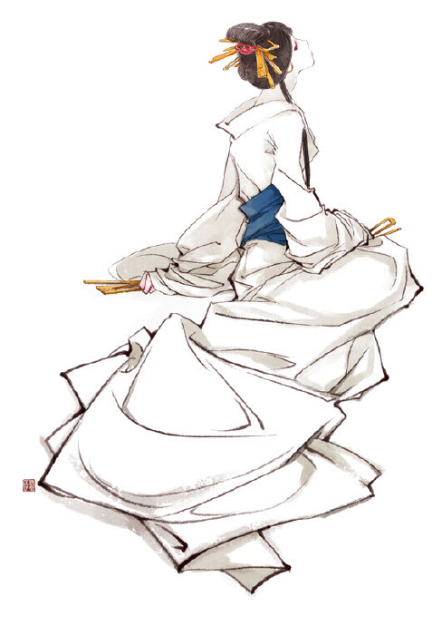

# \[刺客王朝]我所想的刀与葵&伊吹五月真是超棒啊 (2010-01-31 20:03:54)

请注意，下面的所有画稿都不是约稿，而是伊吹五月姑娘看完《刺客王朝》后凭着感觉画的私图：

&#x20;

\
.png>)\

花魁游街（伞下的天女葵，前侍分别是侍女霜和菊，打伞的苏铁惜，天罗刺客，奉剑的易小冉）

\

天女葵（白衣）\
\
.png>)

&#x20;

苏晋安（黑衣）\
\
.png>)\

苏晋安和天女葵（在血腥时代开始之前，八松城被覆盖在白雪之下，男人和女人裸衣缠绵，暂时忘记了将来。）\

&#x20;

&#x20;

&#x20;

&#x20;

我知道伊吹五月的过程是这样的，某一天我在网上看到了这张图：

.png>)\
\
我就去找我们的美术编辑阿布，我说我找到一张画，就是这种感觉，超棒的。

阿布说哦呀我知道这张图，伊吹画的，不好约。

我有点失望，于是说，试试吧。

阿布就去试试了，后来伊吹五月就给九州志第二季画了插图。

&#x20;

作者和画家遇见的最好的状况大概就是这样，作者看到画家的画说，超棒的，画家看到作者的文说，我想给他画。

嗯，好比我遇见张旺，然后遇见伊吹五月。

&#x20;

看见私图比看见杂志的约图更开心点，原因无非是书是写给你期待的那些人看的，有人是你期待的，看完了，而且把它画出来了，画得又合乎你的心意，除了暴爽，你还能有什么其他心情？

&#x20;

所以我就暴爽了。

&#x20;

看完这些画，我在夜里把《刺客王朝·葵》的外篇《晚雪浓情抄》拿出来又翻了一遍，这是我在写完这部小说之后第一次原原本本地自己看一遍。

&#x20;

这真的是一篇我想写的小说。

&#x20;

虽然我不知道有几人会喜欢。

&#x20;

我写的书分两类，一类是我知道什么人会喜欢，我特意这么写的，我并不想贬低这类作品，这说明我的能耐，是个技术活，而且我也很喜欢写别人喜欢看的东西，之后被称赞；第二类是我不知道什么人会喜欢，只是我想写的，如果我一直写这种作品，大概会劳心劳力，而且收入微薄。

&#x20;

《刺客王朝》是第二类。

&#x20;

我自己重新去读这本书的时候，好像读一个陌生人写的书，回头看去，每一句对话都透着弦外之音，也不知道当初为什么要花那么大的心力去这么写。

&#x20;

要在中国卖出10万本以上的书也许不难，要找到10万个我期待的读者大概很难。我总是猜测多数读者是没有耐心去读我的弦外之音的，这是一部始终没有坦荡表白的小说，男人和女人永远淡淡地说着不着边际的话，每一句话下心潮涌动。

&#x20;

为什么还是这么写了？我也说不太清楚，大概还是觉得有些话不能说出来，一说出来，就错了。

&#x20;

如果读这篇博文的人还没看过《刺客王朝》……未免剧透可以不看下面的……如果看过了觉得已经毋庸我废话的读者，也跳过吧……只是随手写点东西，感谢伊吹五月，同时写给那些想知道我为什么要写这些角色的读者：

&#x20;

苏晋安：

&#x20;

这个男人大概没有伊吹画中的那么完美，但当他少年的时候，他也该是有这么一双总是低垂的眼睛吧。

有的男人很容易自卑的，可能是因为太骄傲，譬如苏晋安。

这个人你只有给他刀柄让他握着他才会觉得安全。

其实我是觉得苏晋安是爱天女葵的。

但是他没法因为一个女人爱他就心安。

直到他失去了他唯一心爱的女人……他永远不能心安了，只能用更大的力气抓住刀柄，开始杀戮。

所谓自己把自己往死路上整的人，苏晋安就是了。

可他没办法，他的少年时代决定了他未来的路，他曾经蜷缩在雪夜的小屋里等着有人爱他，寒冷笼罩了他，他很孤独，像个孩子。可是在他最需要温暖的时候，却没有人及时来到他面前。

等那个女人来的时候，他的心已经被浸在血色中了。

&#x20;

天女葵：

&#x20;

其实阿葵真的是蛮好的一个女人，她是个妓女，但她自始至终都是无辜的。

犯错的人只是苏晋安。

但是阿葵爱的是苏晋安。

直至她为易小冉而自杀，把易小冉称作自己的丈夫时，她仍然爱的是苏晋安。

我就是这么的想的。

可是八松城里那个苏晋安已经不在了，所以天女葵也不想活了。

一个女人在过去深爱过的男人面前，把另外一个男人称作丈夫，为他自杀。这是一场彻头彻尾的秀，其实是要做给第一个男人看的，让他难过。

那么其实她还是爱苏晋安。

爱得很绝望。

她确实很懂苏晋安，苏晋安被她临死的一击彻底击伤了，他强撑着离开的时候，仿佛灵魂都被抽走了。

至此苏晋安其实已经死了。

这个女人的美和聪明真是一把好快的刀。

比苏晋安的绯刀更快。

&#x20;

我大概也会爱上这种女人吧。

&#x20;

最后，我喜欢最后那张男人拥抱着女人的图，男人闭着眼睛沉默，女人的目光迷离。

听着积雪在小屋顶上滑动的簌簌声。

&#x20;

今年的冬天真是特别的冷。

&#x20;

去年见夏达的时候，夏达说她的《子不语》中有句台词，说：“错过，不是错了，而是过了。”

事后总想起这句台词。

苏晋安和天女葵的故事就是这样。

&#x20;

感谢：

&#x20;

伊吹五月。

&#x20;
